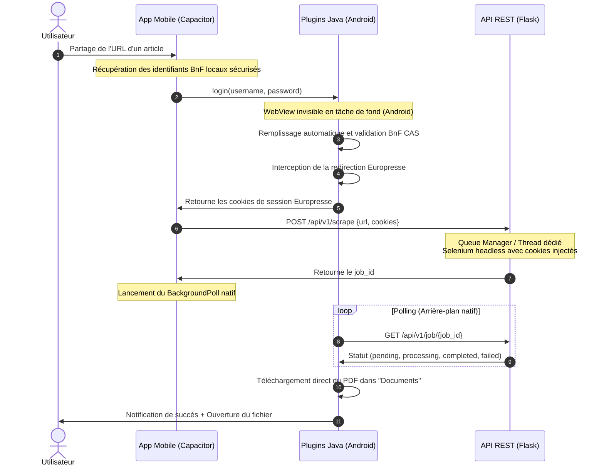

# Documentation du Fonctionnement : Presse Scraper

Ce document détaille le fonctionnement complet de l'écosystème **Presse Scraper**, composé de deux briques principales :
1. **L'API Backend & Moteur de Scraping** (`read-scraper-api`) : Le serveur Python Flask chargé d'orchestrer la file d'attente, de lancer les sessions Chrome automatiques (Selenium) et de générer les documents PDF.
2. **L'application mobile autonome** (`pressscraper`) : L'interface mobile hybride (Capacitor) et ses modules natifs Java (Android) permettant l'intégration système et l'authentification transparente.

---

## 1. Architecture Générale & Modèle "Cookie-Relay"

L'architecture est construite autour du protocole **Cookie-Relay**. L'application mobile gère les identifiants système pour acquérir une session utilisateur valide auprès de la bibliothèque nationale (BnF) et transmet les cookies de session temporaires à l'API serveur pour qu'elle puisse scraper l'article sans stocker les mots de passe des utilisateurs sur le serveur.

### Diagramme d'intégration (Cookie-Relay)

---

## 2. L'Application Mobile (Dépôt `pressscraper`)

L'application mobile est une application hybride basée sur **Capacitor** (HTML, CSS, JS) enrichie de plugins Android écrits en **Java** pour les fonctionnalités de bas niveau.

### A. Intégration Système (Partage)
* **`MainActivity.java`** : Intercepte les actions de partage Android (`ACTION_SEND`, `ACTION_PROCESS_TEXT`, `ACTION_VIEW`) lorsqu'un utilisateur partage un article depuis une application de presse tierce (Le Monde, Libération, Le Parisien...).
* L'intention (intent) interceptée est extraite et son texte/URL est envoyé au JavaScript de Capacitor via un événement window (`sharedText` ou `sharedUrl`).

### B. Les Plugins Natifs Java (Android)
1. **`BnfLoginPlugin.java`** :
   * **`login(username, password)`** : Instancie un composant `WebView` natif Android masqué en arrière-plan. Il charge la page de connexion de la BnF, y injecte le nom d'utilisateur et le mot de passe via du JavaScript, clique sur soumettre, détecte la redirection réussie vers le domaine Europresse, extrait les cookies correspondants via le `CookieManager` d'Android et les renvoie sous forme de structure JSON.
   * **`downloadFile(url, filename)`** : Exécute le téléchargement réseau en arrière-plan d'un fichier PDF généré par le serveur et l'enregistre localement dans le dossier public `Documents` de l'appareil Android.
   * **`showNotification(title, body, articleId)`** : Déclenche des notifications système classiques et gère le clic pour ouvrir l'article correspondant dans l'application.

2. **`IntentForwarderPlugin.java`** :
   * Permet d'écouter et de récupérer les intents partagés de manière plus fiable directement depuis la couche Javascript de Capacitor.

3. **`BackgroundPollPlugin.java`** :
   * Gère le polling d'état du job de scraping. Il effectue des requêtes réseau HTTP natives toutes les 5 secondes vers l'endpoint `/api/v1/job/{job_id}`.
   * Fonctionne de façon autonome en tâche de fond même si l'application est suspendue par le système.
   * Envoie une notification système native en cas de réussite (`📰 Article téléchargé`) ou d'échec (`❌ Échec du téléchargement`).

### C. Le Frontend Mobile (`index.html`)
* Construit en HTML/CSS/JS "Vanilla" avec le framework CSS personnalisé (thème sombre, police Inter).
* **Gestion d'État** : Stocke les jetons d'accès BnF chiffrés, l'historique local et l'URL du serveur API Flask dans le `localStorage`.
* **Flux de Scraping** :
  1. À la réception d'un lien partagé (ou entrée manuelle), il vérifie la validité des cookies BnF locaux.
  2. Si expirés ou inexistants, il appelle `BnfLogin.login` pour renouveler la session de manière invisible.
  3. Il appelle ensuite le serveur `POST /api/v1/scrape` avec l'URL de l'article et la nouvelle liste de cookies.
  4. Si un job est créé, il lance simultanément le polling via le plugin natif `BackgroundPoll` et un polling JS pour mettre à jour l'interface graphique de progression.
  5. Une fois terminé, il récupère le contenu HTML pour l'afficher ou charge l'iframe PDF.

---

## 3. Le Serveur API Backend (`read-scraper-api`)

Le serveur backend est une application REST construite en **Python** avec **Flask**, une base de données **SQLite**, et un système de file d'attente multithreadé.

### A. Point d'Entrée & Initialisation (`backend/main.py`)
* Configure les logs avec rotation quotidienne (conservés pendant 7 jours).
* Initialise la base de données SQLite.
* Nettoie automatiquement les données anciennes (articles de plus de 30 jours, jobs et fichiers temporaires de plus de 7 jours).
* Lance le gestionnaire de file d'attente `QueueManager` dans un thread indépendant.
* Expose le port de l'application (par défaut `5000`) et sert les interfaces statiques (Frontend web public et Admin Panel).

### B. Modèle de Données & SQLite (`backend/models/database.py`)
La base de données locale se situe dans `backend/data/scraper.db` et comprend les tables suivantes :
* **`articles`** : Contient les métadonnées des articles extraits (ID, URL d'origine, titre, contenu HTML brut, chemin local du PDF généré, site source, dates).
* **`articles_fts`** : Table virtuelle FTS5 de SQLite pour permettre la recherche plein texte rapide dans les titres et contenus des articles sauvegardés.
* **`scraping_jobs`** : Suivi des tâches asynchrones (ID, URL cible, statut `pending`/`processing`/`completed`/`failed`/`cancelled`, priorités, messages d'erreur, compteur de tentatives et données JSON de debug).
* **`api_keys`** : Table gérant l'accès sécurisé à l'API. Chaque appareil génère un hash sha256 unique pour s'authentifier.
* **`temp_api_keys`** : Clés éphémères pour des validations à durée limitée.
* **`admin_passwords`** : Hash du mot de passe administrateur pour l'accès aux routes protégées.
* **`scraping_stats`** : Métriques journalières (total, réussites, échecs, durée moyenne).

### C. Endpoints REST & Routage (`backend/api/routes.py` & `admin_routes.py`)
Toutes les requêtes API sont protégées par le header `X-API-Key` validé par le middleware d'authentification (`backend/middleware/auth.py`).

#### API Publique (`routes.py`) :
* **`GET /init`** : Route unique d'initialisation permettant de générer la toute première clé API d'administration si aucune n'est présente en base de données.
* **`POST /api/v1/register`** : Permet à un terminal mobile de s'enregistrer avec son identifiant unique de périphérique (`device_id`) et d'obtenir sa clé API.
* **`POST /api/v1/scrape`** : Reçoit l'URL de l'article et les cookies BnF. Vérifie le cache de l'URL pour un retour instantané si disponible. Sinon, crée un job de scraping à l'état `pending` avec les cookies stockés dans le champ JSON `data` du job.
* **`GET /api/v1/job/{job_id}`** : Retourne l'état précis du job (statut, étape courante, description de l'action en cours).
* **`POST /api/v1/job/{job_id}/cancel`** : Annule un job en attente.
* **`GET /api/v1/article/{article_id}`** : Récupère les données complètes de l'article.
* **`GET /api/v1/article/{article_id}/pdf`** : Télécharge le fichier PDF généré.
* **`GET /api/v1/articles`** : Liste et pagine les articles stockés.
* **`GET /api/v1/search`** : Effectue une recherche plein texte dans les articles.

#### API Administration (`admin_routes.py`) :
* Gère les statistiques de performance de l'API.
* Permet la création/révocation des clés API clients.
* Offre le contrôle manuel sur le démarrage/arrêt de la file d'attente.
* Permet de forcer des tâches de nettoyage de base de données.

---

## 4. Le Processus Asynchrone de Scraping

Le cœur technologique de l'extraction de l'article repose sur l'intégration entre la file d'attente asynchrone, Selenium et le parseur sémantique local.

### A. Le Gestionnaire de File d'Attente (`QueueManager`)
* Exécute une boucle infinie dans un thread d'arrière-plan.
* Récupère régulièrement les jobs à l'état `pending` ordonnés par priorité.
* Met à jour le job à `processing` et lance le callback de scraping dans un sous-thread.
* **Gestion des erreurs et Retries** : 
  * Si le scraper lève une exception générique, le job is relancé jusqu'à un maximum défini (`MAX_RETRIES`).
  * Si l'erreur est catégorisée comme définitive (par exemple `NoResultException` indiquant qu'aucun article n'a été trouvé, ou une erreur explicite d'authentification BnF), le job passe directement à `failed` sans aucune tentative de relance.

### B. Le Scraping de l'Article (`ScraperService`)
L'exécution se déroule en plusieurs étapes précises :

1. **Vérification du Navigateur** : Initialise un navigateur Google Chrome headless local via Selenium.
   * Le service tente d'abord d'utiliser le pilote par défaut (`/usr/bin/chromedriver`).
   * Sur architecture ARM64 (aarch64), il tente de cibler directement le binaire du confinement Snap pour éviter les erreurs d'exécution.
   * En cas d'échec total, il s'appuie sur `chromedriver-autoinstaller` pour télécharger et installer à la volée la version exacte du driver correspondant au navigateur de la machine hôte.
2. **Extraction des Métadonnées du Site Source** :
   * Charge le site de l'article d'origine (ex: Le Monde, Le Parisien...) via le navigateur.
   * Utilise la bibliothèque **Ophirofox** (`web_scraper/ophirofox_bridge.py`) pour extraire le titre nettoyé, la date de publication et formuler une chaîne de recherche optimale (mots-clés).
   * Si l'extraction échoue, le système demande une recherche manuelle par mots-clés.
3. **Recherche de l'Article sur Europresse** :
   * Le service utilise les cookies BnF (du serveur ou transmis par le mobile) et envoie des requêtes HTTP directes (`search_europresse_target`) pour trouver les résultats de recherche correspondants.
   * **Fallback de recherche Selenium** : Si la recherche HTTP ne retourne aucun résultat, le service bascule automatiquement en mode Selenium : il injecte les cookies dans le navigateur Chrome headless, navigue sur l'URL de recherche Europresse BnF `/Search/Reading`, ferme les fenêtres de pop-up d'acceptation, remplit le champ de recherche `Keywords` et simule le clic de soumission.
4. **Calcul de Score Intelligent** :
   * Tous les articles trouvés subissent un scoring :
     * Similarité de titre (% de correspondance des mots).
     * Bonus de source (+30 points si le logo Europresse correspond au domaine d'origine de l'article partagé).
     * Bonus de longueur de l'article (jusqu'à 20 points basés sur le nombre de mots).
   * L'article ayant le score le plus élevé est sélectionné pour l'extraction.
5. **Téléchargement & Nettoyage** :
   * Télécharge le document HTML brut d'Europresse.
   * Supprime récursivement les balises `<mark>` de surlignement insérées par la recherche d'Europresse afin d'obtenir un texte propre et professionnel.
6. **Génération PDF & Enregistrement** :
   * Exécute `PDFService` (qui utilise au choix **WeasyPrint** ou **PDFKit**) pour transformer le code HTML structuré en fichier PDF localisé dans le répertoire `static/`.
   * Enregistre l'article dans la base SQLite locale et met à jour le statut du job à `completed`.
   * Supprime les captures d'écran de débogage qui ont pu être créées en cours de route.
